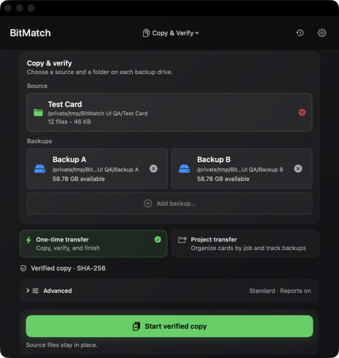
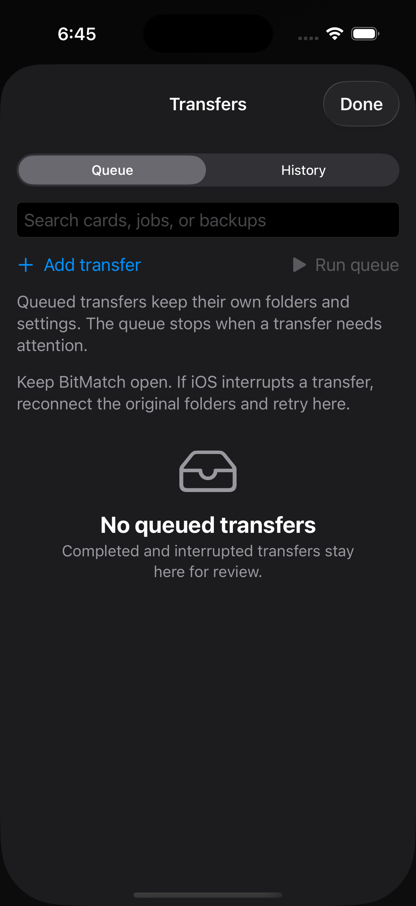
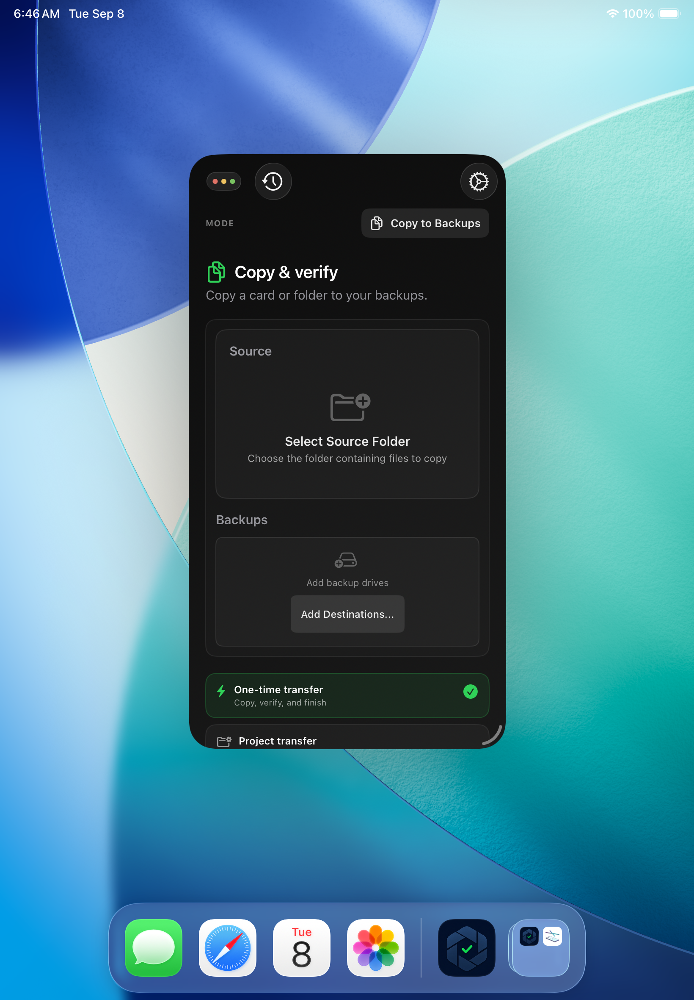

# Setup spacing and mobile heading cleanup

Validated on 2026-09-08 against the working tree based on `713516a`, containing the changes committed with this report. macOS 26.6, Xcode 26.6.

Both `bash test.sh mac-build` and `bash test.sh ipad-build` passed (exit 0). These changes affect presentation only; transfer tests were not rerun.

- Mac setup was inspected at 680×720 and 1,000×720 points with the existing disposable Test Card and two scratch backups. Source occupies its own row, backups use balanced columns, and Start remains visible at the default width. No copy was started for this check.
- iPhone setup and inline Transfers titles were inspected at 402 points wide.
- iPad setup was inspected at 820 points and in a native 375×702 window. Full-width Transfers was also checked. Narrow-window queue interaction was not verified because the automation accessibility owner switched to SpringBoard; this does not affect the visual narrow setup check.
- These are simulator UI checks, not physical-device transfer validation.

## Mac setup

## iPhone Transfers

## Narrow iPad setup

